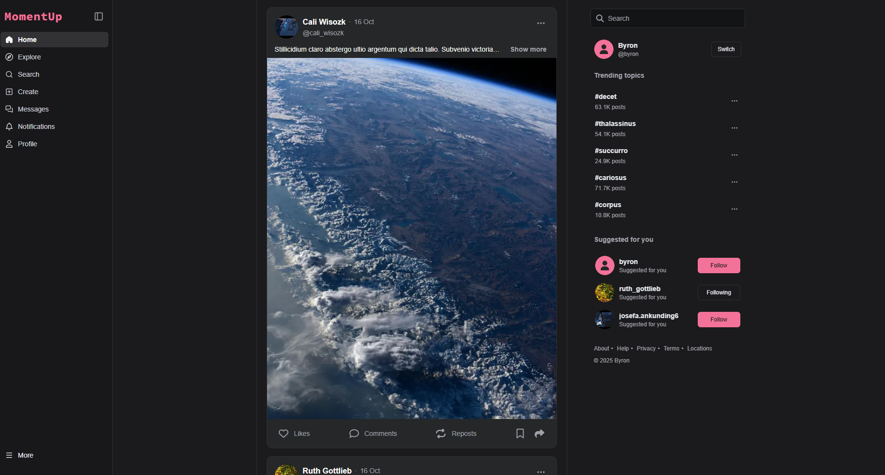

<a name="readme-top"></a>

<!-- PROJECT LOGO -->
<br />
<div align="center">
  <a href="public/logo.svg">
    
  </a>

  <h3 align="center">MomentUp</h3>

  <p align="center">
    A modern full-stack social platform to share posts and connect with the world!
    <br />
    <a href="https://youtu.be/0YJ7lPvjlAo"><strong>Watch Demo »</strong></a>
    <br />
    <br />
    <a href="https://docs.google.com/forms/d/1oUM87A2Kkv7ME9OhRtNDZ_HyMsoKzJR_lOCwna4T_rU/viewform?edit_requested=true">Report Bug</a>
    ·
    <a href="https://docs.google.com/forms/d/1Buxc42n_T9O5ELi6t2nj0SGoZE1yg675G625TSSLJcA/viewform?pli=1&pli=1&edit_requested=true">Request Feature</a>
  </p>
</div>

<!-- TABLE OF CONTENTS -->
<details>
  <summary>Table of Contents</summary>
  <ol>
    <li>
      <a href="#about-the-project">About The Project</a>
      <ul>
        <li><a href="#key-features">Key Features</a></li>
        <li><a href="#built-with">Built With</a></li>
      </ul>
    </li>
    <li>
      <a href="#getting-started">Getting Started</a>
      <ul>
        <li><a href="#prerequisites">Prerequisites</a></li>
        <li><a href="#installation">Installation</a></li>
      </ul>
    </li>
    <li><a href="#usage">Usage</a></li>
    <li><a href="#project-structure">Project Structure</a></li>
    <li><a href="#api-documentation">API Documentation</a></li>
    <li><a href="#license">License</a></li>
    <li><a href="#contact">Contact</a></li>
  </ol>
</details>

<!-- ABOUT THE PROJECT -->

## About The Project



**MomentUp** is a comprehensive full-stack social platform that enables users to share posts through images and videos, connect with others, and engage with content in real-time. Built with modern web technologies, MomentUp emphasizes clean architecture, responsive design, type safety, and an intuitive user experience. From posting content to following friends, exploring trending topics, and managing your profile, MomentUp delivers a complete social experience.

### Key Features

#### 🔐 Authentication & Security
- **Multiple Authentication Methods**: Email/password authentication and Google OAuth 2.0 integration
- **Secure Session Management**: Redis-backed session store with JWT tokens
- **Password Security**: Bcrypt hashing with configurable salt rounds
- **Account Recovery**: Email-based OTP system for password reset
- **Email Verification**: Automated email verification for new accounts
- **CSRF Protection**: Built-in CSRF token validation for all state-changing operations

#### 📝 Posts & Content
- **Create & Share**: Post images and videos with captions and descriptions
- **Engage with Content**: Like, unlike, bookmark, and comment on posts
- **Repost Functionality**: Share posts to your own feed with optional commentary
- **Explore Feed**: Discover new content with paginated explore page (media/posts view)
- **Home Feed**: Personalized feed from users you follow
- **Post Comments**: Nested comment system with like functionality
- **Report System**: Flag inappropriate posts and content

#### 📖 Stories
- **24-Hour Stories**: Share temporary moments that disappear after 24 hours
- **Story Feed**: View stories from people you follow
- **Story Management**: Create and delete your own stories

#### 👥 Social Features
- **User Profiles**: Customizable profiles with avatar, background image, and bio
- **Follow System**: Follow and unfollow users with follow request support
- **Followers Management**: View followers, following lists with search
- **Remove Followers**: Remove unwanted followers from your profile
- **Block/Mute Users**: Block users completely or mute them from your feed
- **User Suggestions**: Smart user recommendations based on mutual connections
- **Follow Requests**: Accept or decline follow requests for private accounts

#### 🔍 Discovery
- **Global Search**: Search for users, posts, and hashtags
- **Search History**: Track your recent searches with local storage
- **Trending Topics**: Discover what's trending with hashtag analytics
- **Explore Page**: Browse popular and recommended content

#### 📱 User Experience
- **Responsive Design**: Fully responsive layout for mobile, tablet, and desktop
- **Dark Mode Support**: System-based and manual dark mode toggle
- **Real-time Updates**: Live feed updates using SWR for data fetching
- **Infinite Scroll**: Seamless pagination for feeds and lists
- **Image Carousel**: Swipe through multiple images in posts
- **Skeleton Loading**: Smooth loading states for better UX
- **Toast Notifications**: Non-intrusive feedback for user actions

#### 📚 Content Management
- **Archive System**: Save liked posts and bookmarks for later viewing
- **Profile Views**: Multiple profile layouts (grid/list view for posts)
- **Media Gallery**: Dedicated view for media content only
- **Tagged Posts**: View posts you're tagged in

#### 🛡️ Additional Features
- **Rate Limiting**: Throttle protection against API abuse
- **Input Validation**: Comprehensive validation using class-validator and Zod
- **Error Handling**: Global error handling with user-friendly messages
- **Logging**: Winston-based structured logging for debugging
- **API Versioning**: Versioned API endpoints (v1) for future compatibility

<p align="right">(<a href="#readme-top">back to top</a>)</p>

### Built With

MomentUp leverages a powerful stack of modern technologies to deliver a robust, scalable, and type-safe platform:

#### Frontend
- [![Next.js][Next.js]][Next-url] - React framework with App Router and Server Components
- [![React][React.js]][React-url] - UI library (React 19)
- [![TypeScript][TypeScript]][TypeScript-url] - Type safety across the entire codebase
- [![TailwindCSS][TailwindCSS.js]][TailwindCSS-url] - Utility-first CSS framework
- [![Radix UI][RadixUI]][RadixUI-url] - Accessible UI components
- **SWR** - Data fetching and caching
- **React Hook Form** - Form handling with validation
- **Zod** - Schema validation
- **Fabric.js** - Canvas manipulation for image editing

#### Backend
- [![NestJS][NestJS]][NestJS-url] - Progressive Node.js framework
- [![TypeScript][TypeScript]][TypeScript-url] - Type-safe backend development
- [![Supabase][Supabase]][Supabase-url] - PostgreSQL database platform
- [![Redis][Redis]][Redis-url] - Session storage and caching
- [![Cloudinary][Cloudinary]][Cloudinary-url] - Media storage and CDN
- **Passport.js** - Authentication middleware
- **JWT** - Token-based authentication
- **Winston** - Logging framework
- **Nodemailer** - Email delivery

<p align="right">(<a href="#readme-top">back to top</a>)</p>

<!-- GETTING STARTED -->

## Getting Started

Follow these steps to set up and run MomentUp locally on your machine.

### Prerequisites

Ensure you have the following installed and configured:

- **Node.js** (v20 or higher)
- **pnpm** (recommended) or npm/yarn package manager
- **Supabase Account**: For PostgreSQL database ([Get started](https://supabase.com))
- **Redis Server**: For session management (local or cloud-based like Upstash)
- **Cloudinary Account**: For media storage ([Sign up](https://cloudinary.com))
- **Google OAuth Credentials**: For Google sign-in ([Console](https://console.cloud.google.com))
- **Email Service**: SMTP credentials for sending emails

### Installation

1. **Clone the repository**:
   ```sh
   git clone https://github.com/byronncat/moment-up.git
   cd moment-up
   ```

2. **Install dependencies for both frontend and backend**:
   ```sh
   # Install backend dependencies
   cd backend
   pnpm install
   
   # Install frontend dependencies
   cd ../frontend
   pnpm install
   ```

3. **Set up environment variables**:

   **Backend** (`backend/.env`):
   ```env
   NODE_ENV=development
   BASE_URL=http://localhost:4000
   PORT=4000
   PREFIX=/v1
   ALLOWED_ORIGIN=http://localhost:3000
   
   # Security
   JWT_SECRET=your_jwt_secret_key
   SESSION_SECRET=your_session_secret
   CSRF_SECRET=your_csrf_secret
   HASH_SALT_ROUNDS=10
   
   # Supabase
   SUPABASE_URL=your_supabase_url
   SUPABASE_KEY=your_supabase_anon_key
   
   # Redis
   REDIS_USERNAME=default
   REDIS_PASSWORD=your_redis_password
   REDIS_HOST=localhost
   REDIS_PORT=6379
   
   # Cloudinary
   CLOUDINARY_CLOUD_NAME=your_cloud_name
   CLOUDINARY_API_KEY=your_api_key
   CLOUDINARY_API_SECRET=your_api_secret
   
   # Email (SMTP)
   EMAIL_HOST=smtp.gmail.com
   EMAIL_PORT=587
   EMAIL_SECURE=false
   EMAIL_USERNAME=your_email@gmail.com
   EMAIL_PASSWORD=your_app_password
   
   # Google OAuth
   GOOGLE_CLIENT_ID=your_google_client_id
   GOOGLE_CLIENT_SECRET=your_google_client_secret
   ```

   **Frontend** (`frontend/.env.local`):
   ```env
   NEXT_PUBLIC_API_URL=http://localhost:4000/v1
   NEXT_PUBLIC_CLOUDINARY_CLOUD_NAME=your_cloud_name
   ```

4. **Set up the database**:
   ```sh
   cd backend
   # Run database migrations (if available in backend/src/modules/database)
   # Or manually set up tables using the SQL files
   ```

5. **Start the development servers**:

   **Backend**:
   ```sh
   cd backend
   pnpm run dev
   ```

   **Frontend** (in a new terminal):
   ```sh
   cd frontend
   pnpm run dev
   ```

6. **Access the application**:
   - Frontend: Open [http://localhost:3000](http://localhost:3000)
   - Backend API: [http://localhost:4000/v1](http://localhost:4000/v1)

<p align="right">(<a href="#readme-top">back to top</a>)</p>

<!-- USAGE EXAMPLES -->

## Usage

### For Users

- **Sign Up / Login**: Create an account with email or sign in with Google
- **Create Posts**: Share your moments with images/videos and captions
- **Explore Content**: Browse the explore page to discover new posts and users
- **Stories**: Share temporary 24-hour stories with your followers
- **Engage**: Like, comment, bookmark, and repost content you enjoy
- **Follow Users**: Build your network by following interesting accounts
- **Search**: Find users, posts, and trending hashtags
- **Profile Management**: Customize your profile, view your posts, likes, and bookmarks
- **Settings**: Configure your account preferences and privacy settings
- **Notifications**: Stay updated with follow requests and interactions

### For Developers

- **API Documentation**: Check `backend/src/API.md` for detailed endpoint documentation
- **Code Quality**: Run `pnpm run check` to run type-checking, linting, and formatting
- **Development Mode**: Use hot-reload for both frontend (`pnpm run dev`) and backend (`pnpm run dev`)
- **Build Production**: 
  ```sh
  # Backend
  cd backend && pnpm run build && pnpm run start
  
  # Frontend  
  cd frontend && pnpm run build && pnpm run start
  ```

<p align="right">(<a href="#readme-top">back to top</a>)</p>

<!-- PROJECT STRUCTURE -->

## Project Structure

```
moment-up/
├── backend/                 # NestJS backend application
│   ├── src/
│   │   ├── modules/        # Feature modules
│   │   │   ├── auth/       # Authentication & authorization
│   │   │   ├── core/       # Posts, comments, stories
│   │   │   ├── user/       # User profiles & relationships
│   │   │   ├── search/     # Search functionality
│   │   │   ├── suggestion/ # User & content suggestions
│   │   │   ├── notification/ # Notification system
│   │   │   └── database/   # Database configuration
│   │   ├── common/         # Shared utilities
│   │   │   ├── decorators/ # Custom decorators
│   │   │   ├── guards/     # Auth guards
│   │   │   ├── filters/    # Exception filters
│   │   │   └── interceptors/ # Response interceptors
│   │   └── configurations/ # App configuration
│   └── API.md             # API documentation
│
└── frontend/               # Next.js frontend application
    ├── src/
    │   ├── app/           # App router pages
    │   │   ├── (auth)/    # Auth pages (login, signup)
    │   │   ├── (protected)/ # Protected routes
    │   │   │   ├── (sidebar)/ # Main app with sidebar
    │   │   │   │   ├── (aside)/ # Pages with aside
    │   │   │   │   │   ├── (index)/ # Home feed
    │   │   │   │   │   ├── explore/  # Explore page
    │   │   │   │   │   ├── search/   # Search page
    │   │   │   │   │   ├── profile/  # User profiles
    │   │   │   │   │   ├── post/     # Post detail
    │   │   │   │   │   ├── archive/  # Bookmarks & likes
    │   │   │   │   │   └── notifications/ # Notifications
    │   │   │   │   └── (non-aside)/ # Pages without aside
    │   │   │   │       └── settings/  # Settings page
    │   │   │   └── @modal/  # Parallel route modals
    │   │   └── (social-auth)/ # OAuth callbacks
    │   ├── components/    # Reusable components
    │   │   ├── common/    # Common UI components
    │   │   ├── icons/     # Icon components
    │   │   ├── post/      # Post-related components
    │   │   ├── story/     # Story components
    │   │   └── ui/        # Shadcn UI components
    │   ├── services/      # API services
    │   ├── hooks/         # Custom React hooks
    │   ├── libraries/     # Utility libraries
    │   └── styles/        # Global styles
    └── public/           # Static assets
```

<p align="right">(<a href="#readme-top">back to top</a>)</p>

<!-- API DOCUMENTATION -->

## API Documentation

For detailed API documentation including all endpoints, request/response formats, and authentication requirements, please refer to the [API Documentation](backend/src/API.md) file.

### Key API Modules:

- **Auth** (`/v1/auth/*`): Login, register, logout, OAuth, password recovery
- **Posts** (`/v1/posts/*`): Create, read, like, bookmark, repost posts
- **Comments** (`/v1/comments/*`): Create, read, like, delete comments
- **Stories** (`/v1/stories/*`): View and manage 24-hour stories
- **Users** (`/v1/users/*`): Profile management, follow/unfollow, block/mute
- **Search** (`/v1/search`): Search users, posts, and hashtags
- **Suggestions** (`/v1/suggestion/*`): User recommendations, trending topics
- **Notifications** (`/v1/notifications/*`): User notification system

<p align="right">(<a href="#readme-top">back to top</a>)</p>

<!-- LICENSE -->

## License

Distributed under the MIT License. See `LICENSE` for more information.

<p align="right">(<a href="#readme-top">back to top</a>)</p>

<!-- CONTACT -->

## Contact

Ngo Cao Anh Thinh | anhthinhncat@gmail.com | +84 933276382

Project Link: [MomentUp](https://moment-up-client.vercel.app/post/633892597244367762)

<p align="right">(<a href="#readme-top">back to top</a>)</p>

---

## Acknowledgments

- [Next.js](https://nextjs.org/) - The React Framework
- [NestJS](https://nestjs.com/) - A progressive Node.js framework
- [Radix UI](https://www.radix-ui.com/) - Accessible component primitives
- [Lucide Icons](https://lucide.dev/) - Beautiful & consistent icon set
- [Supabase](https://supabase.com/) - Open source Firebase alternative
- [Cloudinary](https://cloudinary.com/) - Media management platform
- [Redis](https://redis.io/) - In-memory data structure store

<p align="right">(<a href="#readme-top">back to top</a>)</p>

<!-- MARKDOWN LINKS & IMAGES -->
<!-- https://www.markdownguide.org/basic-syntax/#reference-style-links -->

[Next.js]: https://img.shields.io/badge/Next.js-000000?style=for-the-badge&logo=next.js&logoColor=white
[Next-url]: https://nextjs.org/
[React.js]: https://img.shields.io/badge/React-20232A?style=for-the-badge&logo=react&logoColor=61DAFB
[React-url]: https://react.dev/
[TypeScript]: https://img.shields.io/badge/TypeScript-3178C6?style=for-the-badge&logo=typescript&logoColor=white
[TypeScript-url]: https://www.typescriptlang.org/
[TailwindCSS.js]: https://img.shields.io/badge/Tailwind_CSS-38B2AC?style=for-the-badge&logo=tailwind-css&logoColor=white
[TailwindCSS-url]: https://tailwindcss.com/
[RadixUI]: https://img.shields.io/badge/Radix_UI-161618?style=for-the-badge&logo=radix-ui&logoColor=white
[RadixUI-url]: https://www.radix-ui.com/
[NestJS]: https://img.shields.io/badge/NestJS-E0234E?style=for-the-badge&logo=nestjs&logoColor=white
[NestJS-url]: https://nestjs.com/
[Supabase]: https://img.shields.io/badge/Supabase-3ECF8E?style=for-the-badge&logo=supabase&logoColor=white
[Supabase-url]: https://supabase.com/
[Redis]: https://img.shields.io/badge/Redis-DC382D?style=for-the-badge&logo=redis&logoColor=white
[Redis-url]: https://redis.io/
[Cloudinary]: https://img.shields.io/badge/Cloudinary-3448C5?style=for-the-badge&logo=cloudinary&logoColor=white
[Cloudinary-url]: https://cloudinary.com/
